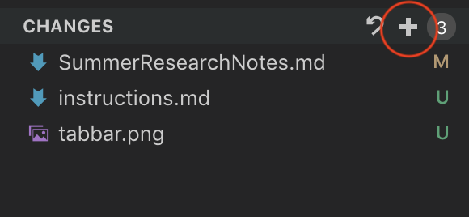
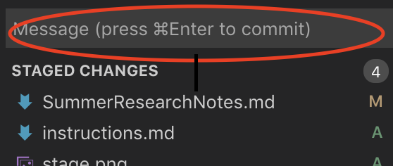
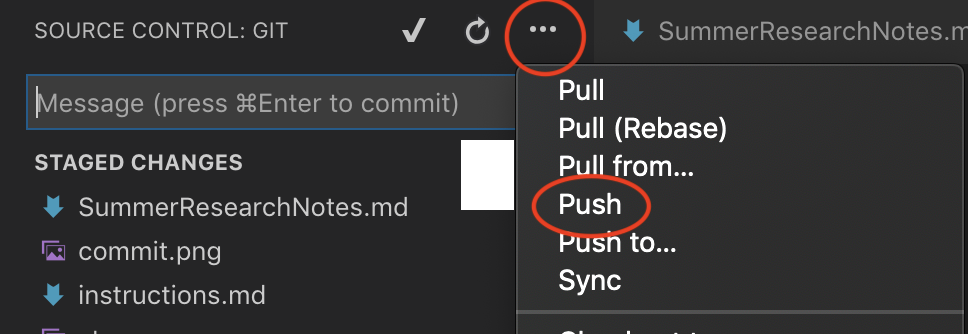

## VSCode Git Instructions
#### Disclaimer: I haven't tried this with multiple accounts on Github, but it works with mine. I'm thinking that if the student has multiple github accounts, configure the local .git file to the user settings that the account is used for. i.e `git config user.name "CianteJones"` rather than `git config --global user.name "Ciante Jones"` I think this could fix the issue Prof. Bang was having with the UI. I don't know or certain though.

1. Once we make changes to the files click on the 3rd tab (middle tab) that has the branches.

  

2. Then we need to click on the pluses in the git control tab to stage all the files that were changed. You can also click the pluses one by one per file if you don't want to add a certain file to the stage area

  
 

3. The files will move to stanged changes. This is where I initially got confused. Since I'm used to the terminal, git commit -m is the first thing that comes to mind, however, I didn't see the Command-Enter to commit. But, you type whatever commit message you want up there and hit Command-Enter (I'm pretty sure it's Ctrl-Enter for Windows users).

  
 

4. After you commit, you need to click on the horizontal ellipsis in the Source Control tab, and click the push. This automatically did it for me, and I'm unsure of what happens with multiple users since I only have my Github account on this computer.

  
 

Overall, I think it's kinda confusing if you don't understand what the different git commands mean. I think this could be a cool alternative if they don't want to use the command line, but I personally don't enjoy the workflow for this system.
